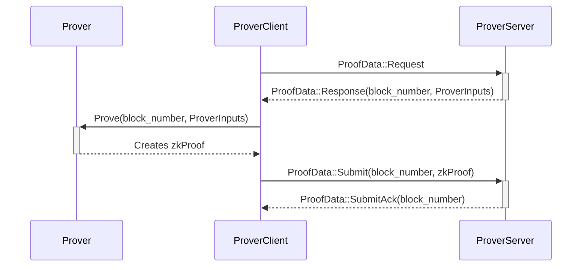

# Ethereum Rust L2 Prover

## ToC

- [ToC](#toc)
- [Prover](#prover)
  - [How to Run](#how-to-run)
- [Workflow](#workflow)
- [Configuration](#configuration)

>[!NOTE]
> The shipping/deploying process and the `Prover` itself is under development.

## Prover

The RISC-V zkVM Prover currently runs an empty program. To mock proof generation and avoid RAM requirements, you can use the following envar: `RISC0_DEV_MODE=1`. [risczero - dev-mode](https://dev.risczero.com/api/generating-proofs/dev-mode).

### How to Run

Dependencies: `cargo-risczero` [dev - risczero - installation](https://dev.risczero.com/api/zkvm/install)

If you are at `crates/l2`, you will have to set the `.env` file (the `.example.env` can be used) and then run `make init-l2-prover`.

The `build_zkvm` flag is used, if you don't have the risc0's "sdk", you can build the prover without the feature to check all the surrounding components of the `zkvm`.

## Workflow

The `Prover Server` is monitoring requests for new jobs from the `Prover Client`, sent when the prover is free. When a new job arrives, the Prover will generate the proof and then the `Prover Client` will send it to the `Prover Server`.

## Configuration

The following environment variables are available to configure the prover:

- `PROVER_SERVER_LISTEN_IP`: IP used to start the Server.
- `PROVER_SERVER_LISTEN_PORT`: Port used to start the Server.
- `PROVER_CLIENT_PROVER_SERVER_ENDPOINT`: Prover Server's Endpoint used to connect the Client to the Server.
