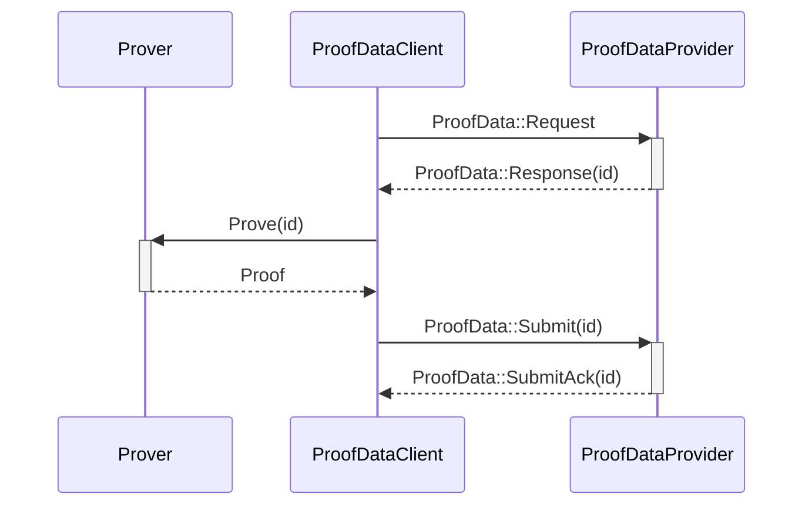

# Ethereum Rust L2 Prover

## ToC

- [Prover](#prover)
- [Workflow](#workflow)
- [Configuration](#configuration)

## Prover

The RISC-V zkVM Prover currently runs a demo fibonacci program. It uses Groth16, which requires at least 128GB of RAM. To mock proof generation and avoid RAM requirements, you can use the `SP1_PROVER=mock` env var.

## Workflow

The ProofDataClient is in charge of request for new jobs to the ProofDataProvider when the prover is free. When a new job arrives, the Prover will generate the proof and then the ProofDataClient will submit it to the ProofDataProvider

## Configuration

The following environment variables are available to configure the prover:

- `SP1_PROVER`: Prover type. Can be `local` or `mock`.
- `PROVER_PROOF_DATA_PROVIDER_ENDPOINT`: Endpoint to connect to the ProofDataProvider.
- `PROVER_ELF_PATH`: Path to the ELF file to prove.
