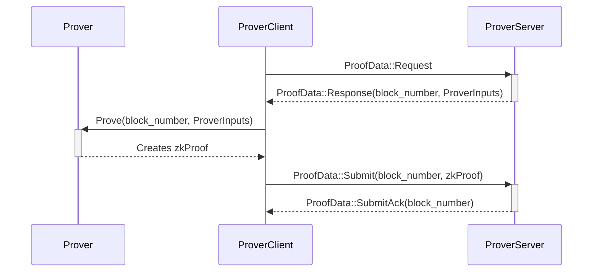

# Ethereum Rust L2 Prover

## ToC

- [ToC](#toc)
- [Prover](#prover)
- [Workflow](#workflow)
- [Configuration](#configuration)

## Prover

The RISC-V zkVM Prover currently runs a demo fibonacci program. It uses Groth16, which requires at least 128GB of RAM. To mock proof generation and avoid RAM requirements, you can use the `SP1_PROVER=mock` env var.

## Workflow

The `Prover Server` is monitoring requests for new jobs from the `Prover Client`, sent when the prover is free. When a new job arrives, the Prover will generate the proof and then the `Prover Client` will send it to the `Prover Server`.

## Configuration

The following environment variables are available to configure the prover:

- `PROVER_SERVER_LISTEN_IP`: IP used to start the Server.
- `PROVER_SERVER_LISTEN_PORT`: Port used to start the Server.
- `PROVER_CLIENT_PROVER_SERVER_ENDPOINT`: Prover Server's Endpoint used to connect the Client to the Server.
- `PROVER_CLIENT_ELF_PATH`: RISCV zkVM ELF file, at the moment: `$(pwd)/prover/program/elf/riscv32im-succinct-zkvm-elf`.
