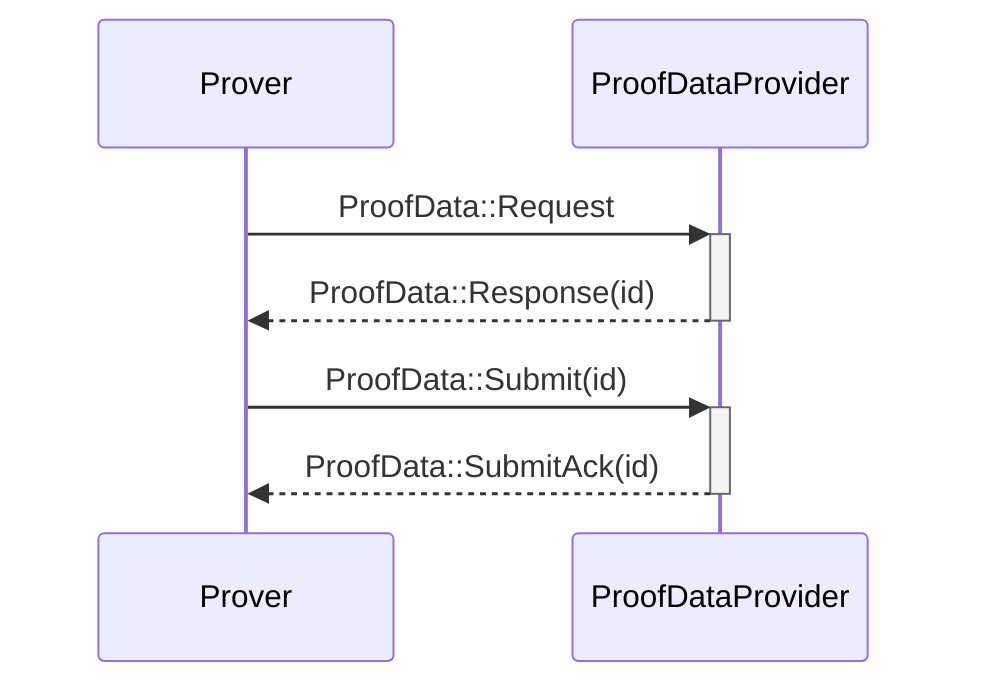

# Ethereum Rust L2 Prover

## ToC

- [Workflow](#workflow)

## Workflow

The Prover is in charge of request for new jobs to the `ProofDataProvider` when it's free. Then, it will generate the proof and when it's finished, it will submit it via the `ProofDataProvider`.

