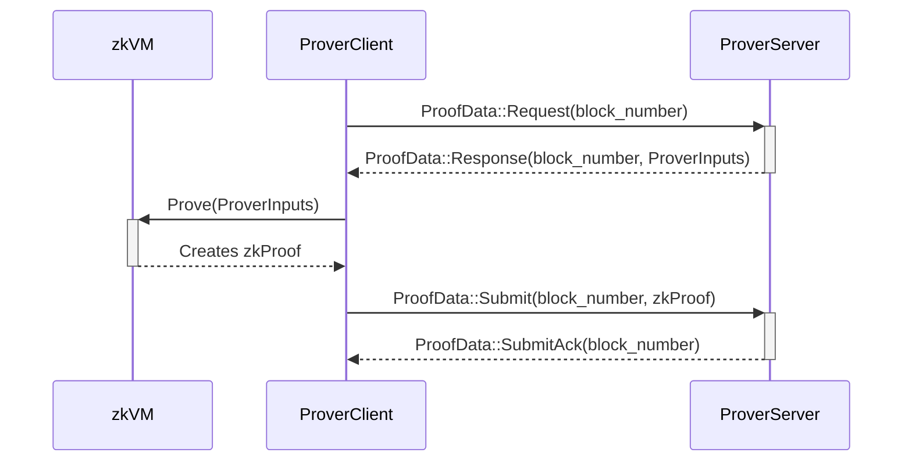

# Ethereum Rust L2 Prover

## ToC

- [ToC](#toc)
- [What](#what)
- [Prover State](#prover-state)
- [Workflow](#workflow)
- [How](#how)
  - [Dev Mode](#dev-mode)
    - [Quick Test](#quick-test)
  - [GPU mode](#gpu-mode)
    - [Proving Process Test](#proving-process-test)
- [Configuration](#configuration)

>[!NOTE]
> The shipping/deploying process and the `Prover` itself is under development.

## What

The prover consists of two main components: handling incoming proving data from the `L2 proposer`, specifically the `prover_server` component, and the `zkVM`. The `prover_client` is responsible for this first part, while the `zkVM` serves as a RISC-V emulator executing code specified in `crates/l2/prover/zkvm/interface/guest/src`. 
Before the `zkVM` code (or guest), there is a directory called `interface`, which indicates that we access the `zkVM` through the "interface" crate.

In summary, the `prover_client` manages the inputs from the `prover_server` and then "calls" the `zkVM` to perform the proving process and generate the `groth16` ZK proof.

## Prover State

The `prover_client` saves its state in the file located at `directories::ProjectDirs::data_local_dir()/ethereum_rust_l2/prover_state.json`.

It is assumed that the `prover_server` is initiated beforehand and that the `prover_client` starts afterward. After receiving a `SubmitAck`, the client saves the last prover block header in the file. If the client goes down, it will read the file, extract the block number, and add 1, so the next request to the server will be for `last_proven_block_number + 1`.

If the `prover_server` goes down, it will start its count from 0. Consequently, when the prover client requests a higher block, this may result in a panic.

Currently, the state of the `prover_server` is not being saved.

## Workflow

The `Prover Server` monitors requests for new jobs from the `Prover Client`, which are sent when the prover is available. Upon receiving a new job, the Prover generates the proof, after which the `Prover Client` sends the proof back to the `Prover Server`.



## How

### Dev Mode

**Dependencies:**
- [RISC0](https://dev.risczero.com/api/zkvm/install)

To run the blockchain (`proposer`) and prover in conjunction in a development environment, set the following environment variable: `RISC0_DEV_MODE=1` [(docs)](https://dev.risczero.com/api/generating-proofs/dev-mode). If you are in the `crates/l2` directory, you will need to set the environment variable for `dev_mode`. The `.env.example` file should suffice.

To start the `prover_client`, use the following command:

```sh
make init-l2-prover
```

The `build_zkvm` flag is used, if you don't have the risc0's "sdk", you can build the prover without the feature to check if all the surrounding components of the `zkvm` can be compiled.

#### Quick Test

To test the `zkvm` execution quickly, the following test can be run:

```sh
cd crates/l2/prover
make perf_test_proving
```

### GPU mode

**Dependencies (based on the Docker CUDA image):**

>[!NOTE]
> If you don't want to run it inside a Docker container based on the NVIDIA CUDA image, [the following steps from RISC0](https://dev.risczero.com/api/generating-proofs/local-proving) may be helpful.

- [Rust](https://www.rust-lang.org/tools/install)
- [RISC0](https://dev.risczero.com/api/zkvm/install)

Next, install the following packages:

```sh
sudo apt-get install libssl-dev pkg-config libclang-dev clang
```

To start the `prover_client`, use the following command:

```sh
make init-l2-prover-gpu
```

#### Proving Process Test

To test the `zkvm` proving process using a `gpu` quickly, the following test can be run:

```sh
cd crates/l2/prover
make perf_gpu
```

## Configuration

The following environment variables are available to configure the prover:

- `PROVER_SERVER_LISTEN_IP`: IP used to start the Server.
- `PROVER_SERVER_LISTEN_PORT`: Port used to start the Server.
- `PROVER_CLIENT_PROVER_SERVER_ENDPOINT`: Prover Server's Endpoint used to connect the Client to the Server.
